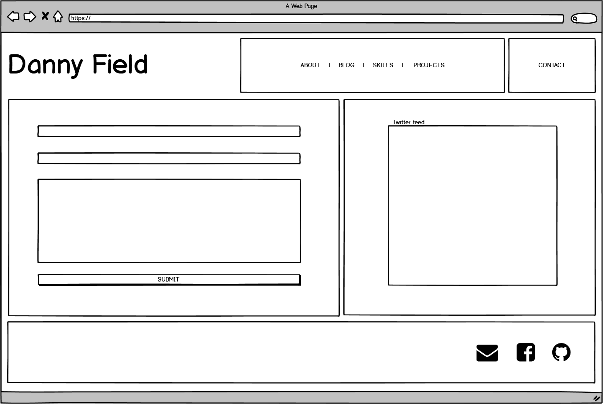

# Website

https://dannyfield.netlify.com/

# Github repo

https://github.com/DannyField/portfolio

# Purpose

The purpose of the site is to promote myself as a full-stack developer. I also wanted to incorporate my skills as a cinematographer as I believe that could help potential employers and businesses wanting to hire me.

However, over time I plan on making it more coder and developer related focused. Currently it may be too focused on the film side of things, however this will change once I develop more projects in the next few months.

I wanted to create a site that reflected myself as a junior dev but also had a visual and professional style that matched my own.

# Functionality and Features

Originally I had really liked the design by PGL Pipelines. I found the design simple yet professional. The color's complementary each other well.

###### https://www.pglpipelines.co.uk/

So originally I had set out to create a similar design.

After my mock up I had the following:

 Eventually I tested various shades of colors, and settled on

    <!-- light brown -->
    #d7c892
    <!-- grey -->
    #363635
    <!-- blue -->
    #0ca7d2
    <!-- pink -->
    #d38281
    <!-- darker brown -->
    #846c5d

I knew that this would change as I was going to replace the hero image with a photo of myself and base the colors of that image.

In photoshop I was able to select colors based on areas in the image. By doing that, I had the following hex values to use in my project.

    <!-- color back plate - dark -->
    color: #090e17;
    <!-- Purple color used for most of site -->
    color: #202244;
    <!-- light blue. Used for when hovering over items -->
    color: #3b96ca;
    <!-- pink used to highlight effects. -->
    #8b4162;
    <!-- white mostly used for fonts  -->
    color: #f4e3f6;

Google art and culture website was also used to get a feel for the color palette

After the basis of the colors that I would use, I started to film background images that I would use to represent each section on the site.

With the help of CSS I also was able to add animation elements such as when the user hovers over an element.

The idea was create a sense of interactivity with the user. It would give the user a visual response and give them a clue that they can select the element.

Once I did that, it made the website feel more alive and alert. With this skill under my belt I was able to use the same effect across the site.

Another feature added was the twitter feed as seen in the contact page. Since Twitter is a hub for digital professionals and nomads, I wanted to include that. Actually bringing that in was very simple as the twitter developer website has a lot of information to imbed your twitter feed.

The fonts used where Titillium Web. All of the text layout uses 'justify', because I hate it when text isn't neat and straight. With 'justify', text becomes more box shaped,leading each sentence to the same padding and margins; which I firmly believe makes the site (and documents) more neater.

I also used the Google Dev Tools in Chrome and it was handy. It would allow me to un-tick boxes to see how they broke or fixed the site. I also ran the audit tool for desktop and mobile devices.

Many CSS files were created and stored in their own CSS folder. This allowed me to easily troubleshoot issues on a page, instead of trying to manage one massive CSS file. It also allows me to easily change the fonts or colors by modifying only one CSS file.

# Sitemap

Due to the nav bar at the top of the page, it is always accessible from all pages.

There are some external 'send' and 'get' requests as well, such as the email contact form, the QR code [which links to another website] and a 'get' request from twitter that grabs data from my personal twitter feed and includes it on the contact page.

# Wireframes

Due to wanting to create a website similar to the PGL Pipelines, I was already way ahead with the design.

It came together very quickly. I still had some tweaks in mind, but the general layout was what I was going for.

There are some changes that changed during the course of the website production. Details like the padding on the side of elements were removed, as I felt to took focus away from the design.

When it came time to port the site to smaller devices, I realized that my nav bar was disappearing off screen to the side. This took a bit of tweaking as originally the nav bar was a grid. However with the help of media query I was able to make it a flex box and push the elements in a column.

One thing I did a lot of was push to the ‘master’ branch, which pushed to netlify and therefore I was then able to access the site on my mobile phone. The allowed me to directly see the changes. While I used the google dev tools a lot during this phase, it still didn’t beat seeing the real thing work on my iphone.

# Screenshots

It should also be noted that elements change depending where the mouse pointer is.

Once pushed to Netlify, I was able to check the responsive design by checking the website on my phone

# Target Audience

The target audience is potential clients and employers. The website is a showcase of what I have learnt, but in no ways a finished product. As I progress in my learning, my abilities will improve and I will be able to use those skills to enhance the site more. Especially making it more focused on full stack development.

# Project Management

Tasks and goals were tracked via Trello. I’m still not a huge fan of the way it works. I wish there was a better way of ticking off tasks instead of dragging to other tabs. Sometimes I would use sticky 'Post-it' notes to write down the day’s tasks.

# Tech Stack

- **HTML5**

Used to create the content seen on the pages

- **CSS**

Used for the look, color scheme and style. Animations were also done in CSS

- **Netlify**

Used for web-hosting. Was extremely useful as many years ago we had to FTP into the server to upload the html files.

- **GitHub**

Used for version control and deployment. Three branches were made in total. The 'master' branch was used for the website

- **External support**

Websites such as Formspree.io and Twitter were used for sending and receiving data

- **Visual Studio Code 1.41.1**

Used for writing the code

- **Adobe Photoshop and DaVinci Resolve**

These were used for photo manipulation [actually the images are stills from a video camera]

- **PC**

Oddly enough, the whole site was done on a PC. I was able to install Git and use MINGW64 to deploy, create branches, and push to gitHub. The commands were the same as on Linux.

# Thanks to

The following websites helped heaps with the creation of this site.

- https://www.w3schools.com/
- https://css-tricks.com/
- https://developer.mozilla.org/
- https://stackoverflow.com/
- Coder Academy, Harrison Malone and Edward Deam
